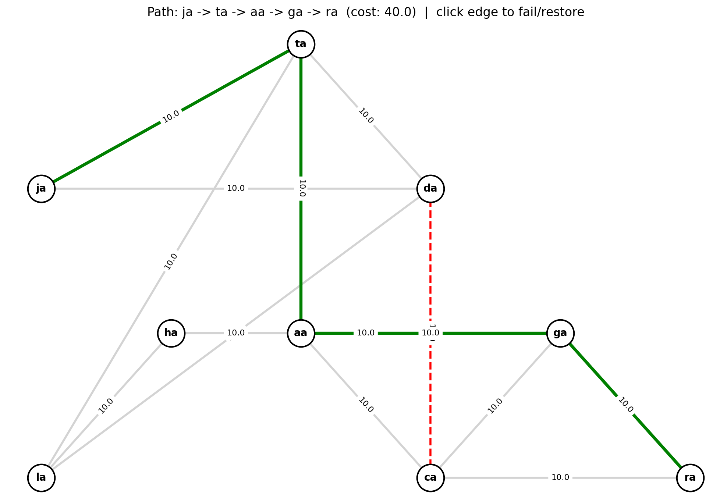

# sr-edge

NetworkX-based tool for visualizing shortest paths and simulating edge failures on a network graph.



## Usage

```bash
python3 sr_edge.py
```

- Select source (A) and destination (Z) nodes from the list
- The shortest weighted path is highlighted in green
- **Click any edge** to mark it as failed (red dashed) — path recalculates automatically
- Click a failed edge again to restore it

## Files

| File | Description |
|---|---|
| `edges.csv` | Network edges: `source, destination, weight` |
| `nodes.csv` | Node positions: `node, x, y` |
| `sr_edge.py` | Main script |
