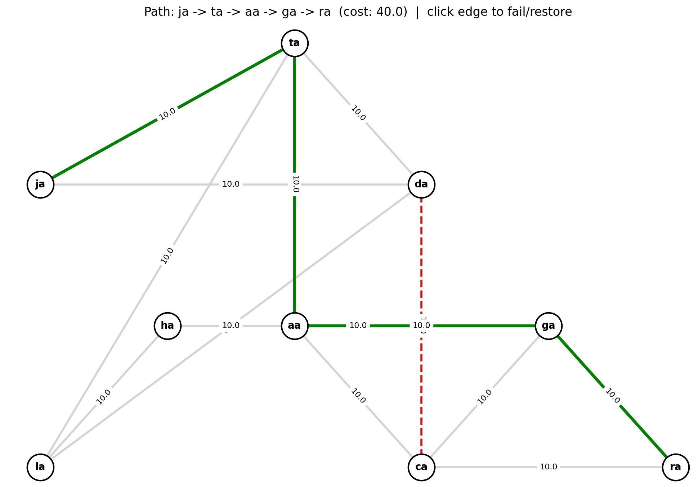

# sr-edge

NetworkX-based tool for visualizing shortest paths, traffic demand placement, and edge failure simulation on a network graph.



## Usage

```bash
python3 sr_edge.py
```

At startup, enter one or more traffic demands. For each demand provide a source node, target node, and bandwidth in Gbps. Press Enter with no source when done.

```
Demand 1  (press Enter with no source to finish):
  Source node: aa
  Target node: ga
  Demand (Gbps): 40

Demand 2  (press Enter with no source to finish):
  Source node: ca
  Target node: ha
  Demand (Gbps): 60

Demand 3  (press Enter with no source to finish):
  Source node:       ← blank to finish
```

You can enter node names or their list numbers.

## Interactive graph

- Edges are colored by utilization of their capacity:
  - **Gray** — no traffic
  - **Green** — < 50% utilized
  - **Orange** — 50–80% utilized
  - **Red** — > 80% utilized (or failed)
- Edge labels show `flow/capacity (%)` when carrying traffic, or the raw weight when idle.
- Line width scales with utilization.
- **Click any edge** to mark it as failed (red dashed) — all demands reroute automatically around the failure.
- **Click a failed edge again** to restore it and reroute.
- The title bar shows how many demands are active and how many are unroutable.

## Routing

Routing uses capacity-constrained Dijkstra: an edge is only considered if its remaining capacity (capacity minus current aggregate flow) is at least equal to the new demand's Gbps. Demands that cannot be placed due to insufficient capacity or topology gaps are reported as unroutable.

## Files

| File | Description |
|---|---|
| `edges.csv` | Network edges: `source, destination, weight[, capacity]` — capacity defaults to 100 Gbps if omitted |
| `nodes.csv` | Node positions: `node, x, y` |
| `sr_edge.py` | Main script |
